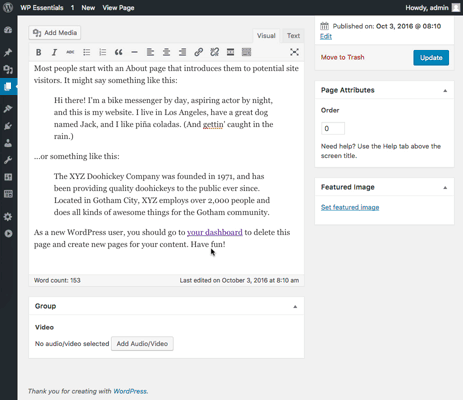
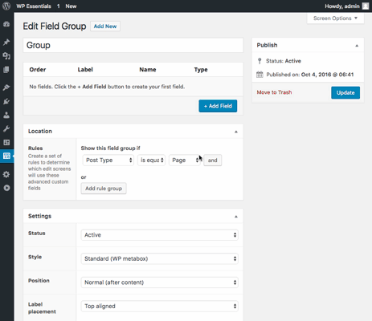

# Advanced Custom Fields: Audio/Video Field

Select an audio or video from the Media Library.

### Compatibility

This ACF field type is compatible with:
* ACF 5 (aka ACF Pro)

### Installation

1. Copy the `acf-audio-video` folder into your `wp-content/plugins` folder
2. Activate the Advanced Custom Fields: Audio/Video Field plugin via the plugins admin page
3. Create a new field via ACF and select the Audio/Video type
